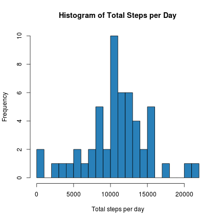
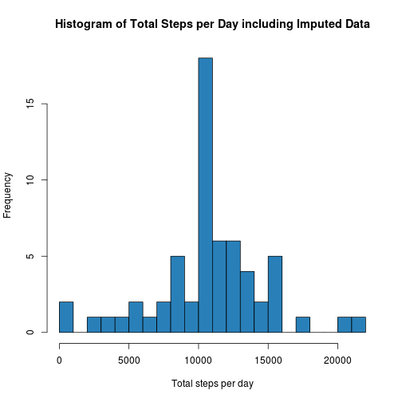

Exploring Personal Activity Data: Steps Over Time
========================================================


## Loading the data

```r
data <- read.csv("activity.csv", head=TRUE)
data <- transform(data,date = factor(date))
```

## Finding the mean of the total number of steps taken per day


```r
steps_by_day <- aggregate(data$steps, by=list(data$date),sum)
labels <- c("Date", "Steps")
colnames(steps_by_day) <- labels
raw_steps_mean <- mean(steps_by_day$Steps, na.rm=TRUE)
raw_steps_median <- median(steps_by_day$Steps, na.rm=TRUE)
```
The computed mean and medians were 1.0766 &times; 10<sup>4</sup> and 10765, respectively.


```r
hist(steps_by_day$Steps, col='#2980b9', xlab="Total steps per day", 
     breaks=20, main="Histogram of Total Steps per Day")
```

 

## Exploring the Average Daily Activity Pattern


```r
step_interval <- aggregate(data$steps, by=list(data$interval), FUN=mean, na.rm=TRUE)

plot(step_interval, type="l", ylab="Number of steps", xlab="5-Minute Interval", 
     main="Time Series Plot of Average Steps in Five Minute Intervals")
```

 

### Identifying the five minute interval with highest activity


```r
max.step.interval.idx <- which.max(step_interval$x)
max.step <- step_interval[max.step.interval.idx,1]
```

The highest activity period is the 835 period.

## Imputing missing values

I used the mean of five minute intervals across all days to impute the missing step data. The strategy here assumes little variance between days in terms of daily activity. Therefore, the mean from recorded days should reasonably reflect activity patterns in days with missing data.


```r
count = 1
for(observation in data$steps){
        if(is.na(observation)){
                # get the interval
                missing_interval <- data[count,]$interval 
                # retrieve the mean from the averaged data set for all days
                imputed_steps <- subset(step_interval, Group.1 == missing_interval, select="x") 
                # replace the missing data with the imputed steps
                data[count,]$steps <- imputed_steps$x
        }
        count <- count + 1
}

missing_count <- sum(!complete.cases(data))
steps_by_day <- aggregate(data$steps, by=list(data$date),sum)
labels <- c("Date", "Steps")
colnames(steps_by_day) <- labels
imputed_steps_mean <- mean(steps_by_day$Steps, na.rm=TRUE)
imputed_steps_median <- median(steps_by_day$Steps, na.rm=TRUE)

hist(steps_by_day$Steps, col='#2980b9', xlab="Total steps per day", 
     breaks=20, main="Histogram of Total Steps per Day including Imputed Data")
```

 

The number of missing observations is 0. The mean and median of the imputed data are 1.0766 &times; 10<sup>4</sup> and 1.0766 &times; 10<sup>4</sup>, respectively.

These values do not significantly differ from the original data without imputed values. Given the imputation strategy, this makes sense. The impact of including the imputed values is relatively minimal in this case.

## Comparing Weekdays and Weekends


```r
library(lattice)
data <- read.csv("activity.csv", head=TRUE)
data <- transform(data,date = as.Date(date))

complete.data <- na.omit(data)  # remove missing data

weekdays <- c("Monday", "Tuesday", "Wednesday", "Thursday", "Friday")
weekend <- c("Saturday", "Sunday")

complete.data$weekday <- weekdays(complete.data$date)
complete.data$dayType <- ifelse(complete.data$weekday %in% weekdays, "Weekday","Weekend")
complete.data <- transform(complete.data, dayType = factor(dayType))

weekends <- subset(complete.data, dayType=='Weekend')
weekdays <- subset(complete.data, dayType=='Weekday')
weekends_aggregate <- aggregate(weekends$steps, by=list(weekends$interval), FUN=mean)
weekdays_aggregate <- aggregate(weekdays$steps, by=list(weekdays$interval), FUN=mean)
weekends_aggregate$dayType <- "Weekend"
weekdays_aggregate$dayType <- "Weekday"
combined <- rbind(weekends_aggregate, weekdays_aggregate)
combined <- transform(combined, dayType = factor(dayType))

xyplot(combined$x ~ combined$Group.1 |  combined$dayType, type="l",
       layout=c(1,2), xlab="Interval", ylab="Steps",
       main="Average Step Patterns: Weekends vs Weekdays")
```

 

There are differences between weekday and weekend activity. The time series plots show that, on average, during weekdays there is more activity in the morning, less activity in the afternoon, with an increase in the early evening. Activity levels are more evenly distributed over weekends. This data accords with intuition: the subject appears to be less physically active during typical working hours, and more active on weekends.
